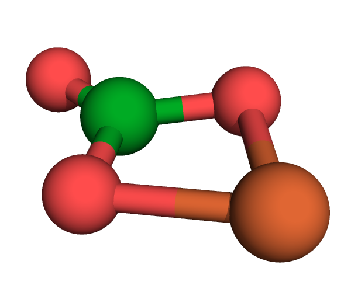

### Tutorial

In this tutorial we will run some calculations on FeCO3.

   
   
The FeCO3 molecule
   

#### DFT geometry optimisation

#### DMFT

#### Removal of CPT approximation

#### Density of States

#### Optical spectra
